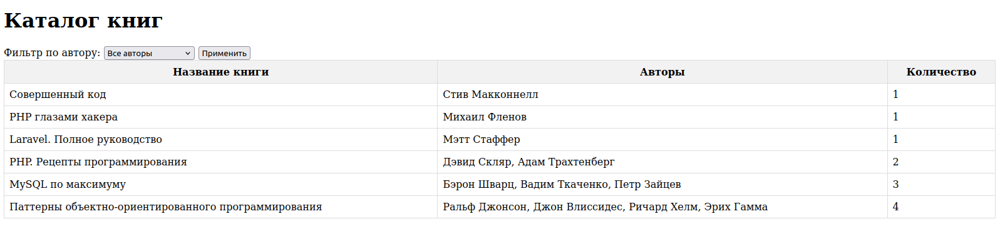

# Каталог книг

**Приложение выполнено в рамках тестового задания**

## Задание:
*Необходимо реализовать каталог книг, в котором будет храниться информация о
книгах и авторах, их написавших.*

## Основной функционал:
Организован просмотр информации о книгах и их авторах в виде html-таблицы, в первой
  графе которой будет название книги, а во второй – имена авторов, её написавших (через
  запятую в случае более одного автора у книги). *
## UI

 

## Использованные технологии
* Docker
* Laravel 10
* Php 8.2
* PostgreSQL

## Сборка и запуск
* docker-compose build
* docker-compose up -d
* docker-compose run --rm compose install
* docker-compose run --rm npm install
* docker-compose run --rm php artisan migrate
* docker-compose run --rm php artisan db:seed --class=BooksAndAuthorsSeeder

## Настройка .env
DB_CONNECTION=pgsql
DB_HOST=pg
DB_DATABASE=bookscatalog
DB_USERNAME=root
DB_PASSWORD=root

